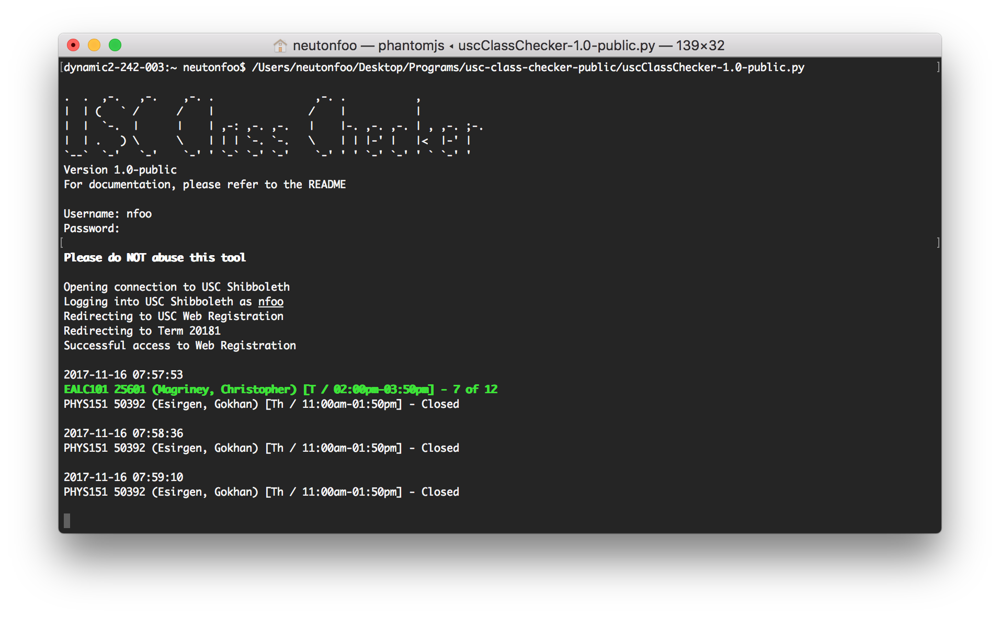

# USC Class Checker (Public)
This script checks for availability of USC Classes and opens a website if availability is detected. The script is built to run headless in the Terminal and requires an active USC login to log into USC Web Registration.

SHA-256 Checksum: `db5b357e412bdb1c998ee947185477be525dedc79a137f81c99d33c59b0bd498`

## Demo



## Do's and Don'ts

* Do use it to check for availability of classes.
* Do use your own USC login when running the script.

* Don't modify the code for malicious purposes (:
* Don't reduce the interval to anything less than 30s (it's set to 30s as default)
  * If you spam USC Web Registration too often, USC IT people might do something to your account idk
  * If USC decides to add a CAPTCHA or something to its Shibboleth login, it's GG for all of us

## How it works

**All of this is done in the Terminal.**

1. Logs into your USC account.
2. Redirects itself to USC Web Registration.
3. Checks availability of classes.
4. If availability is detected, opens a YouTube link.

## Dependencies
* PhantomJS
* Selenium

### Installation of Dependencies on Mac
The dependencies can be installed by running the following commands in Terminal. It will install [PIP](https://pypi.python.org/pypi/pip), [Homebrew](https://brew.sh/) along with the above two dependencies [PhantomJS](http://phantomjs.org/) and [Selenium](http://www.seleniumhq.org/).

Please read the prompts during the installation process.

```console
$ sudo easy_install pip
$ pip install -U selenium
$ /usr/bin/ruby -e "$(curl -fsSL https://raw.githubusercontent.com/Homebrew/install/master/install)"
$ brew install phantomjs
```

## Usage

Run the following command in Terminal. This assumes you are in the same directory as `uscClassChecker-1.0-public.py`.

Conversely, you can drag and drop `uscClassChecker-1.0-public.py` into the Terminal window after `python`.

```console
$ python uscClassChecker-1.0-public.py
```

### Variables

The only file you should modify is `config.py`. Change the following three variables only:

```python
term = 20181
youtubeAlertLink = "https://www.youtube.com/watch?v=2HtiqkDpzSs"

classes = [
    {
      "depCode": "EALC",
      "classCode": "101",
      "sectionNumber": "25601"
    },
    {
      "depCode": "PHYS",
      "classCode": "151",
      "sectionNumber": "50392"
    }
]
```

`term` - Set to the academic year and term.

`youtubeAlertLink` - Set to the URL you want the program to open on detection of class availability.

`classes` - Store the classes to track in a Python dictionary. Change the values between the double quotes `"` to the right of the colon `:` on each line. Add more classes as needed.

## Contact

If you have any questions or requests, you can reach me at nfoo@usc.edu.
