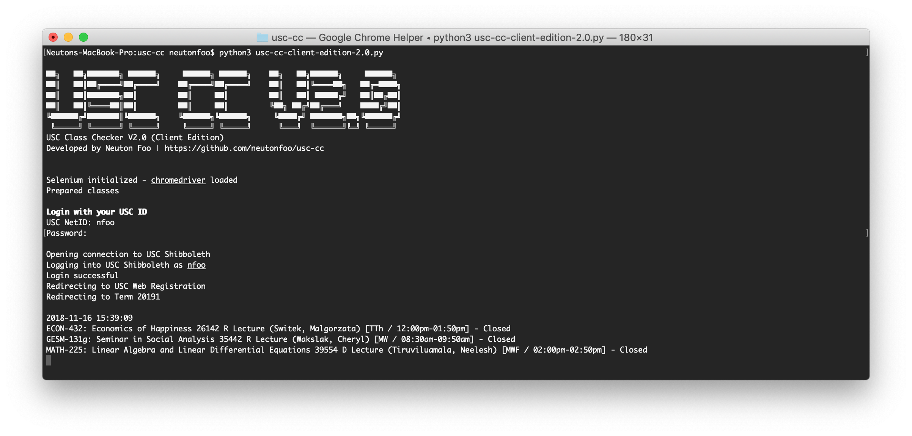
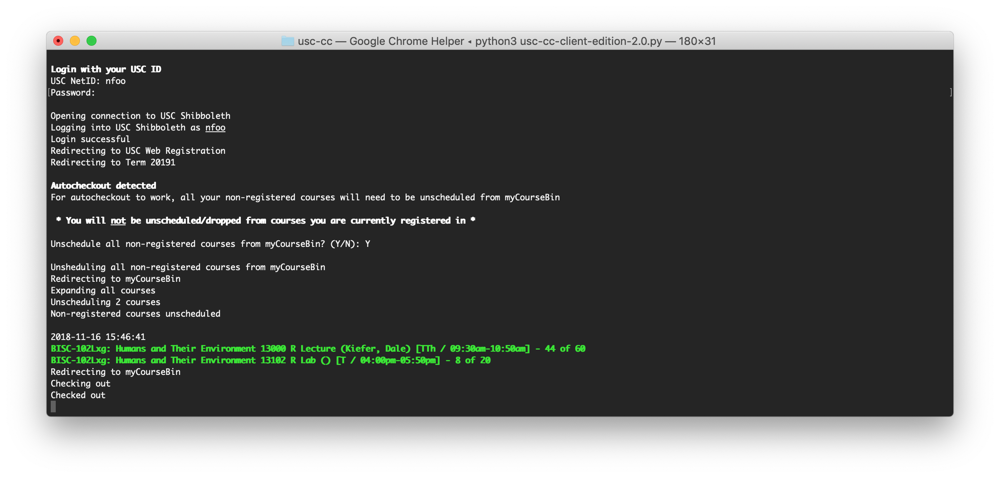

# USC Class Checker V2.0 (Client Edition)

This script checks for the vacancy of USC courses and opens a YouTube link when vacancy is detected. The script was written to run headless in the Terminal.

Additionally, the script allows includes an auto-checkout function that automates the checkout process if vacancy in all required sections (ex. Lecture, Discussion, Labs) of a course is detected.

## Demo





The top demo image shows the script checking for course vacancy at set intervals. Courses detected to have vacancy will be in green font and bolded. Additionally, a YouTube link will open to alert the user.

The bottom image shows the script detecting that both a Lecture and a Lab section have opened up for a certain course. The auto-checkout feature was immediately triggered to register me into the course. The program will continue checking for the remaining courses as defined in the `config.py` file.

## Do's and Don'ts

* Do use it to check for availability of classes.
* Do use your own USC login when running the script.

* Don't modify the code for malicious purposes. (:
* Don't reduce the interval to anything less than 30s (it's set to 30s as default)
  * If you spam USC Web Registration too often, USC IT people might do something to your account idk.

## Dependencies
* Selenium
* chromedriver **or** geckodriver
	* [http://chromedriver.chromium.org/](http://chromedriver.chromium.org/)
	* [https://github.com/mozilla/geckodriver/releases](https://github.com/mozilla/geckodriver/releases)

### Selenium
Selenium is the only package that should be installed with a package manager such as [PIP](https://pypi.python.org/pypi/pip).

If you already have PIP installed, the first command can be skipped.

```console
$ sudo easy_install pip
$ pip install -U selenium
```

### chromedriver or geckodriver

After downloading a copy of either chromedriver or geckodriver, only one of these files should be placed into the folder containing `usc-cc-client-edition-2.0.py`.

If you have a local installation of either chromedriver or geckodriver, you may edit the code to reflect its location.

## Usage

Run the following command in Terminal. This assumes you have already navigated into the same directory as `usc-cc-client-edition-2.0.py`.

Conversely, you can type `python3 ` into the Terminal then drag and drop `usc-cc-client-edition-2.0.py` into the Terminal window.

```console
$ python3 usc-cc-client-edition-2.0.py
```

### Config.py

`config.py` contains variables that may be changed according to a user's needs.

```python
# Core Variables

# School term - Concatenate year with [1 Spring], [2 Summer], [3 Fall]
term = 20191

# Autocheckout - Dangerous, use with caution
autocheckout = True

# Link to open if a class is detected as open
availabilityAlertLink = 'https://www.youtube.com/watch?v=4pUc7SD0PmU'

# Time (seconds) between checks
interval = 30

# Time (seconds) to wait before a TimeoutException is thrown
timeout = 10

# Classes list
classes = [
	{
		'class': 'BISC102',
		'sections': ('13000', '13102'),
		'checkout': True
	}
]
```

`term` - Set to the academic year and term.

`auto-checkout` - If set to `True`, the user will be prompted to unschedule from their non-registered classes. If set to `False`, auto-checkout will not be considered during the session.

`timeout` - The maximum time that can to be elapsed before a `TimeoutException` is thrown.

`interval` - The delay between each check of a set of sections.

`classes` - An array containing a dictionary of course details. The `sections` key should contain all required section numbers. If `checkout` is set to `True` and if `autocheckout` is also set to `True`, the autocheckout process will be triggered for that course.

## Auto-Checkout Feature

In the bottom demo image, you may have noticed that the user was prompted to have all their non-registered courses unscheduled.

Note that this does **not** drop you from any course you are currently registered in.

This is identical to removing all yellow "Scheduled" items on the myCalendar tab.

To clarify, the script will unschedule all non-registered courses in order to empty the set of sections in the next checkout.

When a vacancy is detected in all required sections of a course, the script will automatically schedule these sections and process an automatic checkout.

## Contact

If you have any questions or requests, you can reach me at nfoo@usc.edu.
